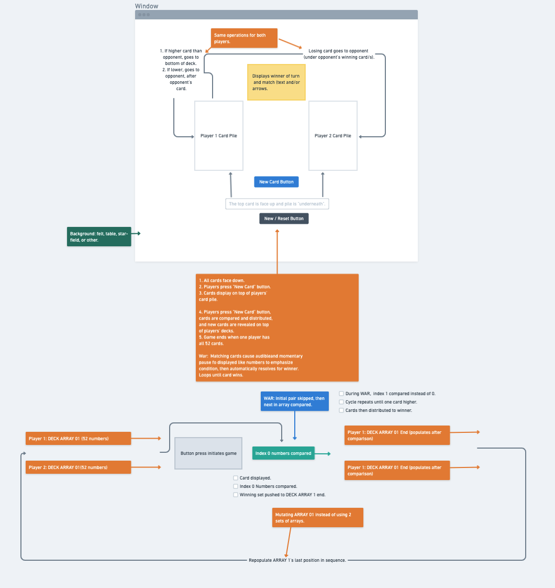

# War Card Game Project 01:

# Description:
### In the War card game, a deck of 52 playeing cards is split in half and distributed to two players. The cards are placed face down and both players reveal their respective top card. The higher of the two cards wins, and the owner of the card takes their winning card and the opponent's losing card and places them at the bottom of their deck. In the event of a tie, (both cards have the same value) "War" is initiated. During war, one card is place face down per player ad then one face up. The player with the higher card wins (ties repeat). The game ends once a player accumulates all 52 cards.

# Images:

# Technologies:
- HTML
- CSS
- JavaScript

# Pseudocode Outline:

## Start-Up State:
> Initial Array containing 52 numbers (4x 2 to 14).

Math.floor and Math.random and distribution function to randomly order and divide the array.

>Set up two arrays, to contain 26 (half of 52) numbers ranging from 2 to 14 (Jack, Queen, King, Ace 11 to 14).

## Button Press:
>Initiates comparison of INDEX 0 of ARRAYS 01 between both players (initial comparison is null?).

Shows next pair in INDEX 0 (new cards).

>Winning / losing pair gets placed into winner's original array's end so it adapts to arrays with different amouts of numbers in them (imitating putting the cards at the bottom of the deck).

## Functions (Other):
>WAR: If a tie senario, the next INDEX 0 numbers are not compared, then runs standard INDEX 0 number comparison.

## End State:
>Game ends once a player accumulates all of the numbers (cards) OR player has an empty ARRAY.

# Stretch Goals:
>Improve visual design.

Supersonic Match Button: Iniates automated match at calculation speed and renders winner.

